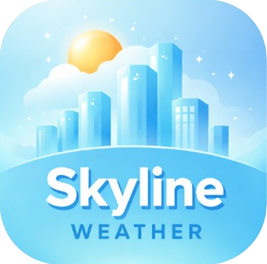
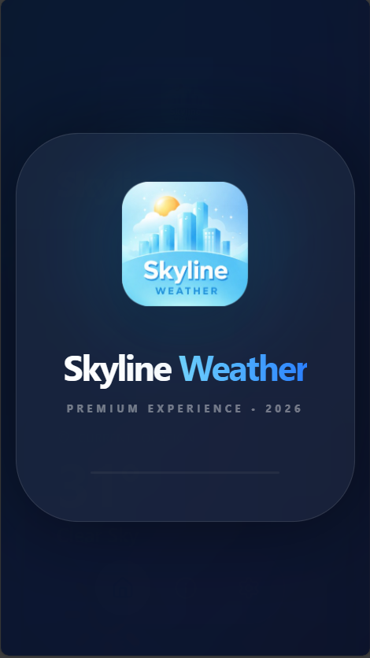
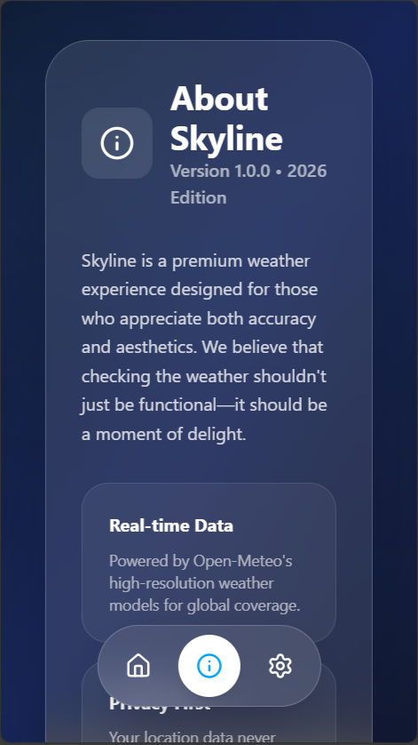
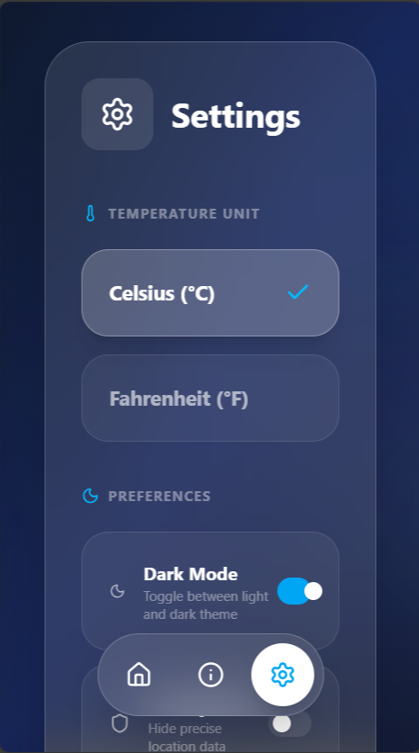
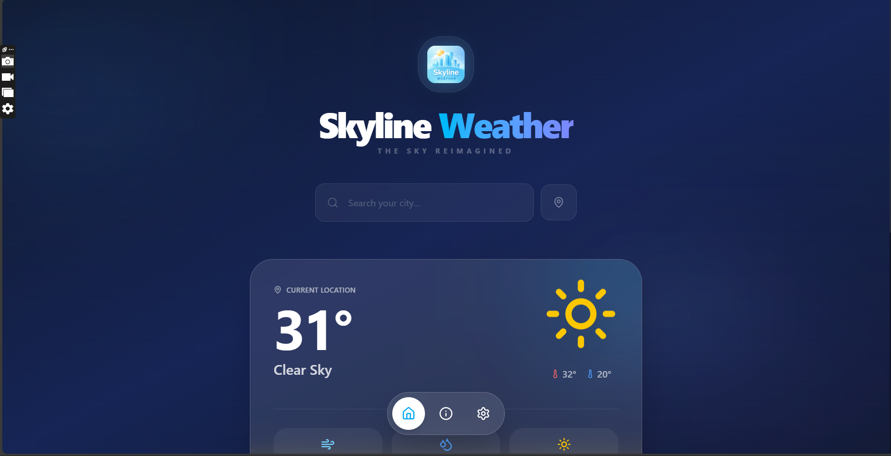

<p align="center">
  
</p>

<h1 align="center">Skyline Weather</h1>

<p align="center">
  <strong>A Premium, Aesthetic Weather Experience for Web & Mobile</strong>
</p>

<p align="center">
  
  
  
  
</p>

---

## 🌌 Overview

Skyline Weather is a modern, high-performance weather application built with **React** and **Vite**, converted into a native mobile experience using **Capacitor**. It features a stunning glassmorphic design, real-time weather data from Open-Meteo, and a premium user interface that makes checking the weather a delight.

### 🌟 Key Features

- **🎯 Precision Forecasts**: Real-time weather data powered by Open-Meteo.
- **📱 True Mobile Experience**: Full Android support with native splash screens and smooth transitions.
- **✨ Glassmorphic UI**: A premium, atmospheric interface with subtle animations and depth.
- **🌓 Dynamic Themes**: Beautifully crafted dark and light modes.
- **📍 Location Intelligence**: Geo-navigation to get weather details for your exact spot.
- **🥚 Hidden Easter Egg**: Discover a special shoutout in the footer!

---

## 📸 Screenshots

### 📱 Mobile Experience
<p align="center">
  
  
  
  
</p>

### 💻 Desktop Experience
<p align="center">
  
</p>

---

## 🛠️ Tech Stack

- **Frontend**: [React 19](https://react.dev/) + [TypeScript](https://www.typescriptlang.org/)
- **Build Tool**: [Vite 6](https://vitejs.dev/)
- **Styling**: [Tailwind CSS 4](https://tailwindcss.com/)
- **Animations**: [Motion](https://motion.dev/)
- **Mobile Engine**: [Capacitor 8](https://capacitorjs.com/)
- **Icons**: [Lucide React](https://lucide.dev/)

---

## 🚀 Getting Started

### Prerequisites
- Node.js (Latest LTS)
- Android SDK (for mobile builds)

### Installation
1. Clone the repository:
   ```bash
   git clone https://github.com/Munib-Jahangir/skyline-weather.git
   ```
2. Install dependencies:
   ```bash
   npm install
   ```

### Running Locally
```bash
npm run dev
```

### Building for Android
```bash
npm run build
npx cap sync
cd android
./gradlew assembleDebug
```

---

## 👩‍💻 Author

**Munib Jahangir**
- 🌐 [Live Web App](https://skyline-weather-self.vercel.app)
- 🎥 [YouTube Channel](https://www.youtube.com/@MunibJahangirDev)
- 🐙 [GitHub Profile](https://github.com/Munib-Jahangir)

---

<p align="center">
  Developed with ❤️ for a better sky experience.
</p>
